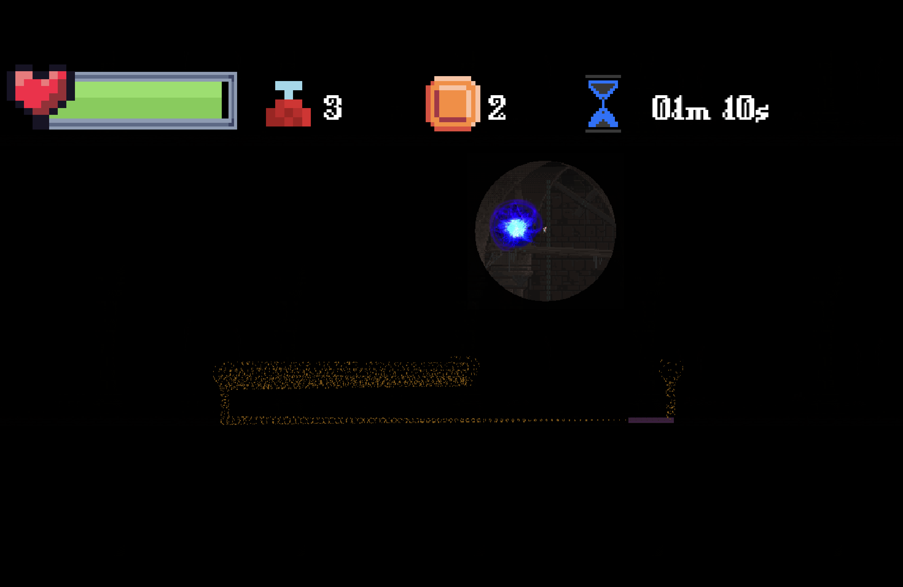

# Re-Dungeon

This is a 2D platformer made using Godot. It features a mechanic where you need to continually attempt a level until you have enough skill points to beat it. 

## Play the game

For mac users, simply run the Re:Dungeon App.

For other, download Godot and load the project. Select *Scenes/start.tscn* as the main scene and run the game

## Things I learnt

The main goal of this project was to code platformer pathfinding, finite state machines, and juicing the game (such as particle effects)

